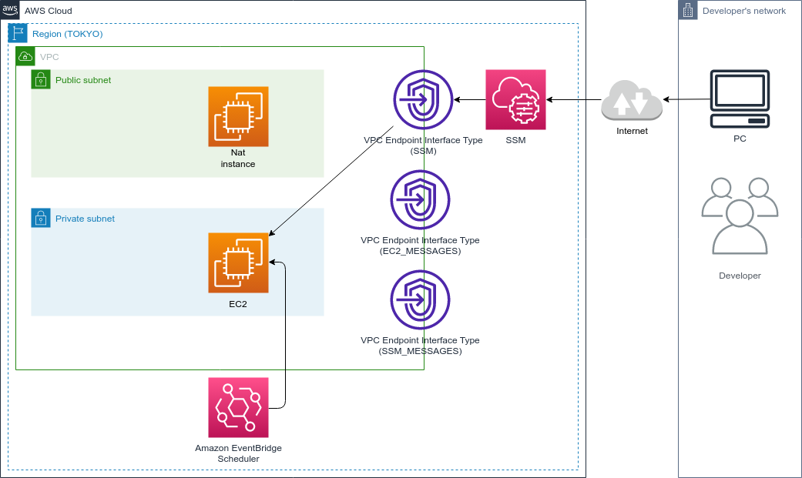

# aws-cdk-ec2-scheduled-power-on-and-off

このリポジトリでは，Amazon EventBridge Scheduler で，EC2 インスタンスの定時起動，定時シャットダウンをする．

## 構成図



## SSH アクセス

```bash
EC2_INSTANCE_ID=$(aws ec2 describe-instances \
    --filters "Name=tag:Name,Values=AwsCdkTemplate-AwsCdkTemplateStack/AwsCdkTemplate-AwsCdkTemplateStack-general_purpose_ec2" \
    --query "Reservations[].Instances[?State.Name=='running'].InstanceId[]" \
    --output text)
ssh -i ~/.ssh/ec2/id_ed25519 admis@$EC2_INSTANCE_ID
```

## Cron 式のフォーマット

https://docs.aws.amazon.com/ja_jp/AmazonCloudWatch/latest/events/ScheduledEvents.html

## よく使うコマンド

### テスト
```
npx npm run test
```
```
npx npm run test -- -u
```

### デプロイ
```bash
npx cdk synth
```
```bash
npx cdk deploy --all --require-approval never
```
```bash
npx cdk destroy --all --force
```
